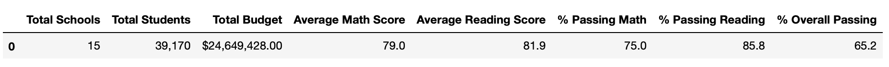
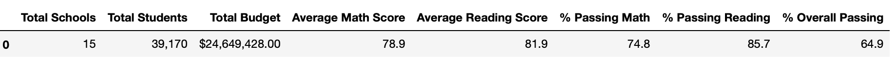
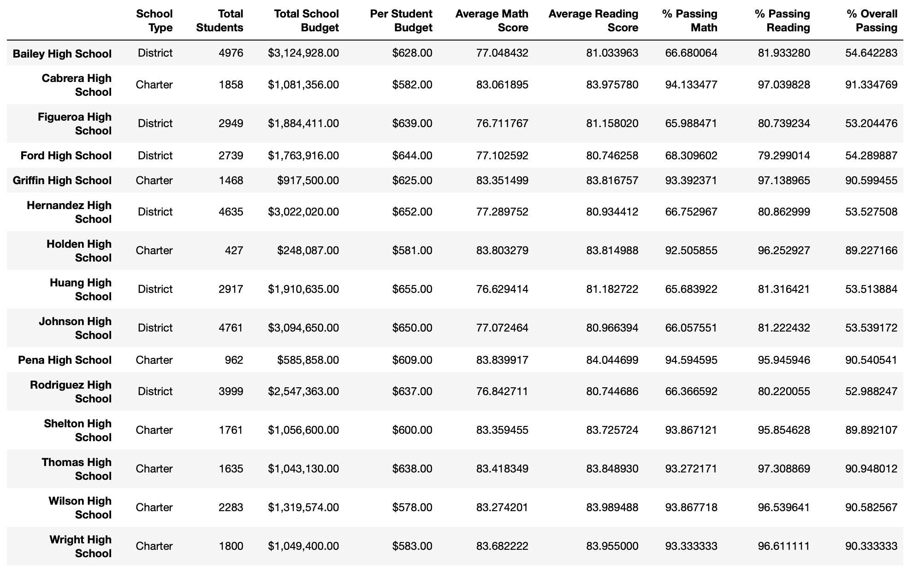
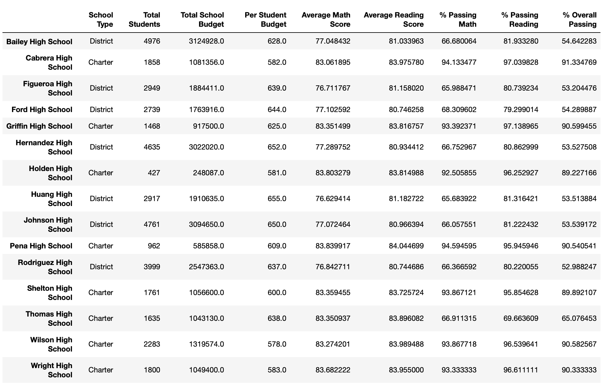
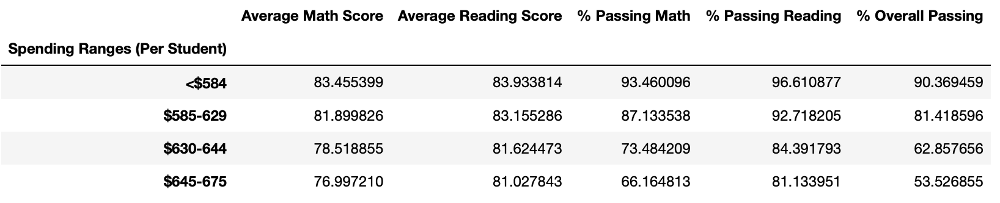
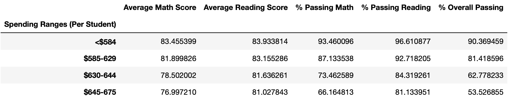
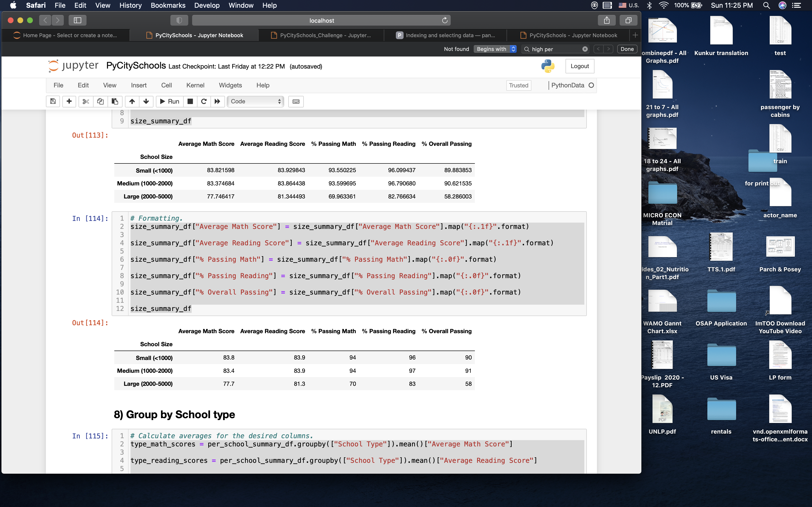
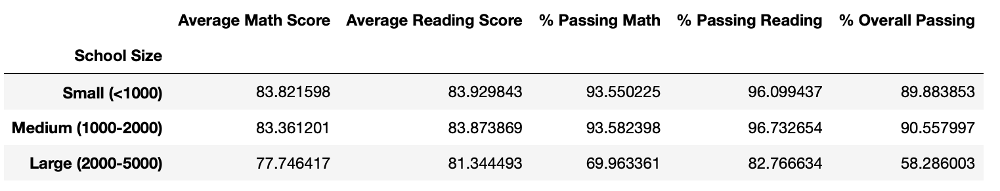

# PyCity School District Analysis
## A) Overview of PyCity School District Analysis:

- Background: 
Following the completion of PyCity school district analysis, the school board has observed that the data file (student_complete.csv) used for the analysis shows evidence of academic dishonesty; specifically, they have noticed that reading and math grades for Thomas High School ninth graders appeared to have been altered. the school baoard ahas requested an updated analysis in ine with this observation.

- Purpose:
The purpose of this analysis is to re-run the PyCity School District analysis by excluding the data for ninth grade student of Thomas High School and report the changes in the results:

- Objectives:
1. Exclude 9th grade students of Thomas High School from the dataset i.e. (student_complete.csv) without altering the original datasource.
2. Analyze the result with new dataset at the District level
3. Analyze the result with new dataset at the school level
4. Report changes in the results by presenting a comparative analysis of the original results versus the results concluded based on the new dataset

- Resources:
1. Datasources:
    1. student_complet.csv
    2. school_complete.csv
2. Software: Python 3.6.1 through Jupyter Notebook:
    1. pandas library
    2. numpy library

## B) Results:

a) District Summary:

Analysis using the complete dataset:

Analysis of dataset excluding 9th garde of Thomas High School:

**Findings:** 
1. Average scores in math declined by 0.01 change from 79.0 to 78.9
2. Average scores in reading had no change and remained at 81.9
3. % Passing Math declined by 0.02% from 75% to 74.8%
4. % Passing Reading declined by 0.01% from 85.8% to 85.7%
5. % Overall Passing declined by 0.03% from 85.2% to 64.9%  

b) School Summary:

Analysis using the complete dataset:

Analysis of dataset excluding 9th garde of Thomas High School:

**Findings:** the results of analysis after excluding 9th grade students of Thomas High School did not change the outcome of the other schools at individual level. Therefore, the outcomes of schools are independent but the overall district outcome, as observed in the above, has slightly changed due to this exclusion of data. In the school summary only the result for Thomas High scholl has changed in the followings:

1. Average scores for both math and reading declined slightly less that a decimal point. This change does not seem to be significant.
2. % Passing Math declined significantly by 26% from 93% to 67%
3. % Passing Reading declined significantly by 27% from 97% to 70%
4. % Overall Passing declined significantly by 26% from 91% to 65%

c) Math and reading scores by grade:

**Findings:** exclusion of the 9th grade student result from the data set had no effect on the scores by grade analysis becuase the excluded data are independent to to the data for other grades. Hoever, the result of 9th grade for Thomas High School is marked as "nan" due to removal of the records in new dataset.

d) Scores by school spending:

Analysis using the complete dataset:

Analysis of dataset excluding 9th garde of Thomas High School:

**Findings:** school spendings and related results did not change except for $630-644 bin. This is becuase the Thomas high School is categorized in this bin as per its budget. There is sslightly decline on average scores and % passing after exclusion of 9th grade student of Thomas High School. The changes are less than a point in scores and less than 0.1% in passing rate, therfore, when the numbers rounded to no decimal point there is almost no changes.

e) scores by school size:

Analysis using the complete dataset:

Analysis of dataset excluding 9th garde of Thomas High School:

**Findings:** school size and related results did not change except for medium(1000 -2000) bin. This is becuase the Thomas high School is categorized in this bin as per its budget. There is slightly decline on average scores and % passing after exclusion of 9th grade student of Thomas High School. The changes are less than a point in scores and less than 0.1% in passing rate, therfore, when the numbers are rounded to no decimal point there is almost no changes.

f) Scores by school type:

